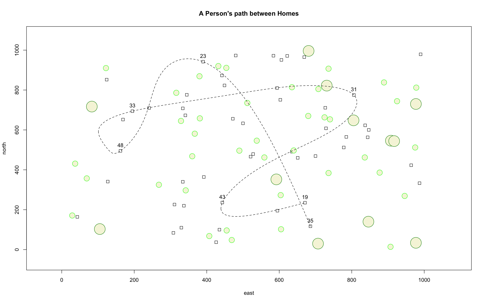

# Challenge Question - plot

This 1000 x 1000 plot was created to simulate a basic neighbourhood with houses, represented by squares, and different sized trees, represented by green circles.
Out of the 50 houses, 7 were randomly selected and labeled to generate a path a person would take between homes.
Since the houses and trees were randomly placed on the graph, the path isn't very realistic since it crosses at several points and it also passes directly through trees.

