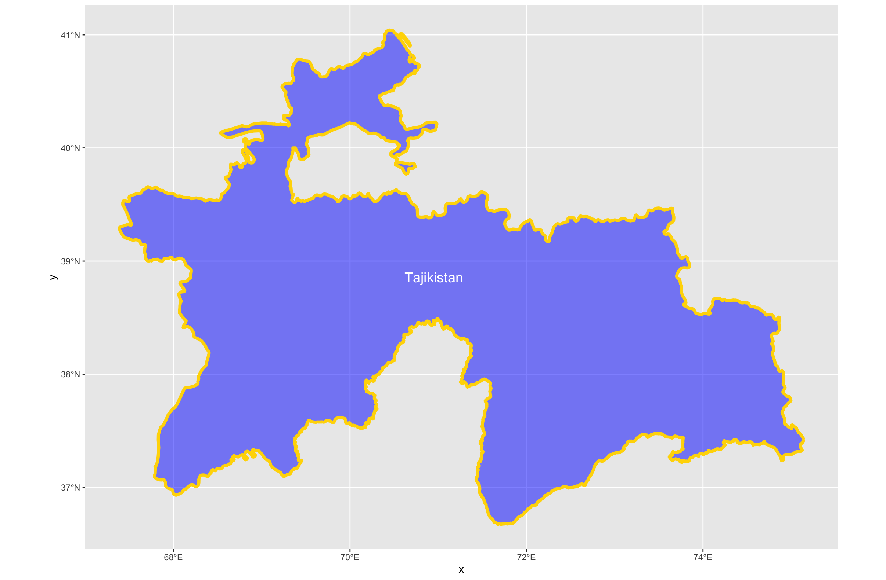

# Tajikistan Administrative Boundaries

For this assignment I plotted the administrative boundaries of Tajikistan.
I picked this country randomly while looking through the different ADM shapefiles provided on the GADM website.
Each of the plots were created by using the ggplot() package with R.
Functions within ggplot() allowed for different sizing of the labels and the line widths of the subdivisions.
In the plot for the second level of administration boundaries, I couldn't figure out how to move the labels so that all text was visible.
Also, the colours are not meant to represent anything in particular since I was just practicing using different names in R.

## International Border (ADM0)

## Provinces/Regions/Capital (ADM1)

## Districts (ADM2)
