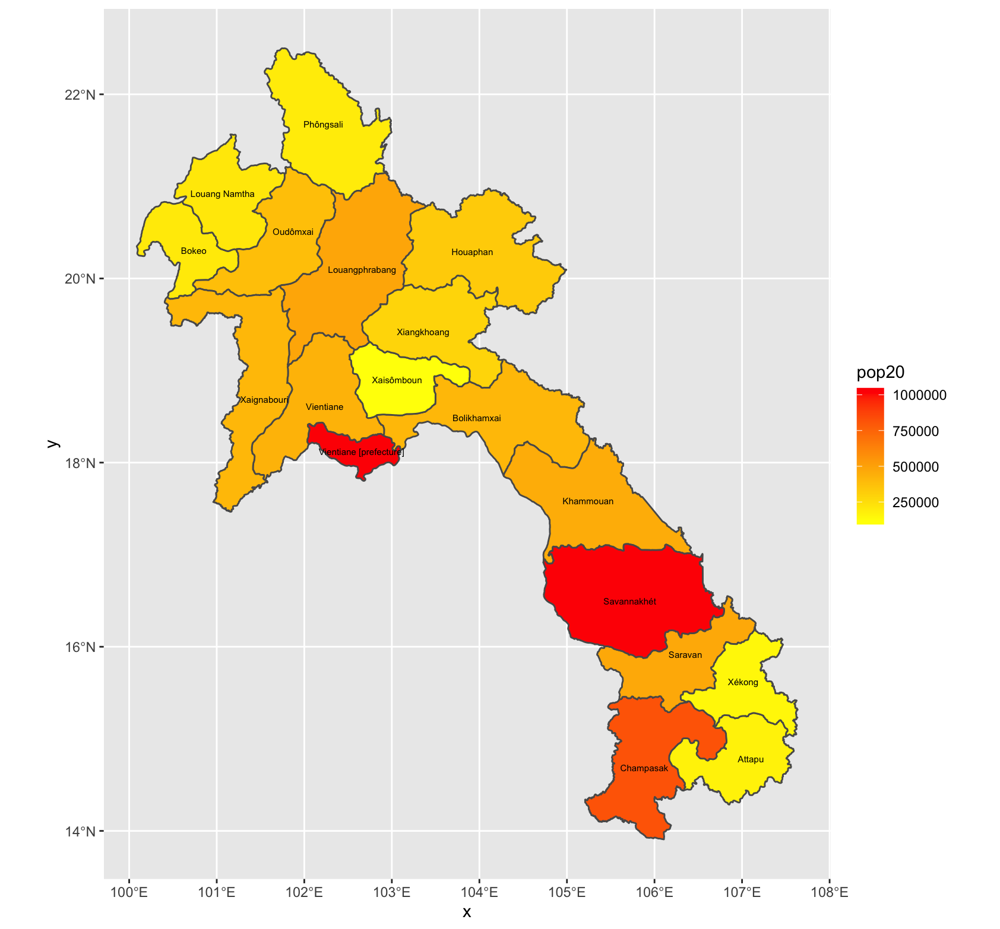
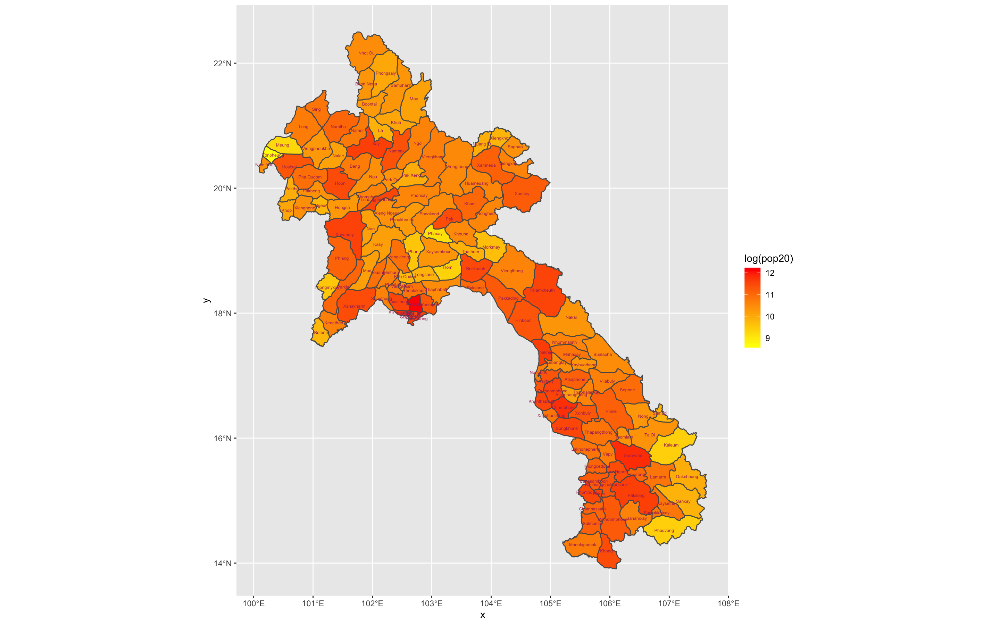
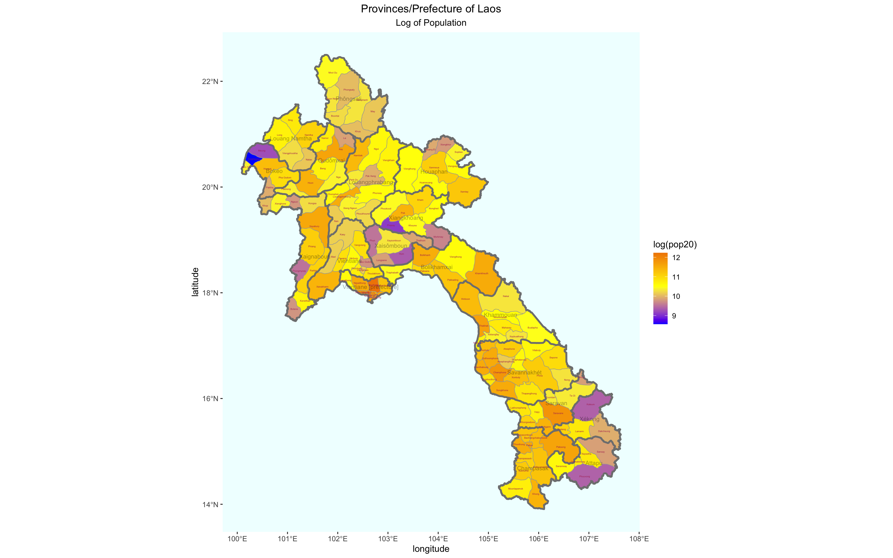

# Population Density of Laos

For extracting 2020 population information from a raster, I changed the country I picked from Tajikistan to Laos.
The raster was downloaded from WorldPop then aggregated to the shapefiles from GADM.
The first plot uses the level 1 administrative boundaries, and the following two use level 2.
In the first two plots, red is used to symbolize high population density and yellow as the lower value.
The last plot has a larger gradient going from high population being orange to yellow to blue.
Also, the population values in the plots using ADM2 are logarithmic.

### Provinces/Prefecture Level

### District Level

### District Level (Stylized)
