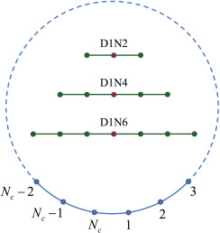

## Data Insight
### Lattice Gas Automaton (LGA)

There are many distribution functions that help describe wealth distribution such as the Boltzmann-Gibbs exponential function, Pareto power-law function, etc.
And although there are many that are accepted, many functions are only applicable in certain types of wealth in populations.
The paper that I read proposes using Lattice Gas Automaton (LGA) as a way to model wealth distribution for a society whether or not people have saving propensities.[^1]
The authors compare their simpler 1D-LGA proposed model to two previously presented models: a 2D-LGA model considering charity regulations[^2] and the CC-model of a closed economic system.[^3]

By the words of the authors, 'the LGA is constructed to describe an artificial society where a monetary exchange may occur if two agents encounter after random movements'. 
This idea is similar to the movement of gas molecules.
The LGA model the authors created consists of two stages: random propagation and economic transaction.
In the first stage, random propagation, the agent either moves to an empty area or stays resting.
The figure below shows the possible positions the agent can move to with D1N2 representing a one-dimensional movement with two spots on each side where the agent can move.
Similarly, D1N4 has two spots on each side, and D1N6 has three spots on each side. 
Next, using numerical tests, the authors found the D1N4 and D1N6 models were able to simulate satisfactory results.

In stage two, this is the simulated economic transaction where two agents that are neighbouring will trade with probability Pt and the amount of money after the transaction is tracked.
There were two types models created to consider if an agent had saving propensity or not.
By comparing the results to the CC-model, the authors were able to validate a more efficient model and thus use for a simulation where they were also able to measure wealth inequality through calculating a Gini coefficient and Kolkata index.
In addition, they found this model to be simpler than the 2D-LGA model and less computationally expensive than the CC-model.

I think that looking at saving propensities is an important predictor for wealth since saving has been shown to reap many benefits and also help with financial security.
Measuring wealth is significant for tracking development and sustainability of a country, so I think continuing to improve wealth distribution models has positive impacts.

[^1]: Lijie Cui, Chuandong Lin. "A simple and efficient kinetic model for wealth distribution with saving propensity effect: Based on lattice gas automaton" (2020): Accessed 2020-10-13. Online: https://doi.org/10.1016/j.physa.2020.125283.

[^2]: Cui, L., & Lin, C. (2020). Lattice–Gas–Automaton modeling of income distribution. Entropy, 22(7), 778. doi:http://dx.doi.org.proxy.wm.edu/10.3390/e22070778

[^3]: Chakraborti, A., Chakrabarti, B. Statistical mechanics of money: how saving propensity affects its distribution. Eur. Phys. J. B 17, 167–170 (2000). https://doi.org/10.1007/s100510070173