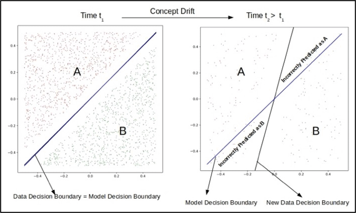
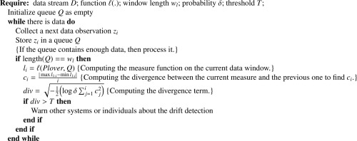

## Data Insight
### Plover & Drift Detection

In reality, it's very possible for a model to lose its predictive power over time.
It may have been a good fit for the data started with, but with new collected data, the distribution of the data has changed and thus changed the goodness of fit.
This is called data drift.
For this data insight, I will talk more about a type of data drift called concept drift.
This occurs when the *y* or response variable we want to predict has changed over time.[^1]

It's important to know when data drift is occurring so that it can be addressed before using a now unfit model for important predictions.
In order to detect these changes, the authors of this paper propose an unsupervised approach they call Plover.
This approach builds off of Algorithmic Stability, which 'presents conditions for the probabilistic convergence between some arbitrary function and its expected value'.
Plover consists of two algorithms.
Plover uses Algorithm 1 to store data in *Q* it receives and begins the computing function ℓ(.)/*Q* once it has an appropriate amount of elements (*wl*).
This results in *li*, and *li* computes the largest and smallest values to be used in *ci*.
The variable *ci* represents the range of data variation of the duration of this calculation.
Lastly, *ci* is used in *div* to compare the mean value from the past measurements. 
When the mean value changes, Algorithmic Stability is affected; if *div* is greater than whatever the threshold *T* is set to be, a drift is detected.
The function ℓ(.) can also measure other test statistics.

**Here is Algorithm 1 written by the authors:**

Algorithm 2 looks more closely at calculating the minimum window or time of these drifts.
The authors tested Plover on synthetic and real-world datasets with known drifts as well as unknown drifts from 
interesting data like Bitcoin and electricity prices.
There have been a lot of supervised drift detection approaches, but the authors were able to form an unsupervised algorithm that is able to detect drift with an appropriate measure function.
They intend to continue to improve Plover for increased application and also adding other measure functions.[^2]

In terms of population modelling, detecting drift is relevant since the human population can change rapidly with natural disasters, war, disease, etc.
Also, with the improvement of population data collection, this can affect the design of previous population models.
And as a whole, detecting data drifts is important to data science.
Lastly, there are many other methods proposed for detecting drift, so the last paper I linked was written in 2020 which looked at a variety of different approaches.[^3]

[^1]: Chowdhury, A., Das, P., & Gupta, M. (2020). Data Drift and Machine Learning Model Sustainability. https://www.analyticsinsight.net/data-drift-and-machine-learning-model-sustainability/

[^2]: de Mello, R., Vaz, Y., Grossi, C., & Bifet, A. (2019). On learning guarantees to unsupervised concept drift detection on data streams. Expert Systems with Applications, 117, 90– 102.

[^3]: Gemaque, R., Costa, A., Giusti, dos Santos, E. (2020). An overview of unsupervised drift detection methods. WIRES Data Mining and Knowledge dDiscovery, 10(6)

