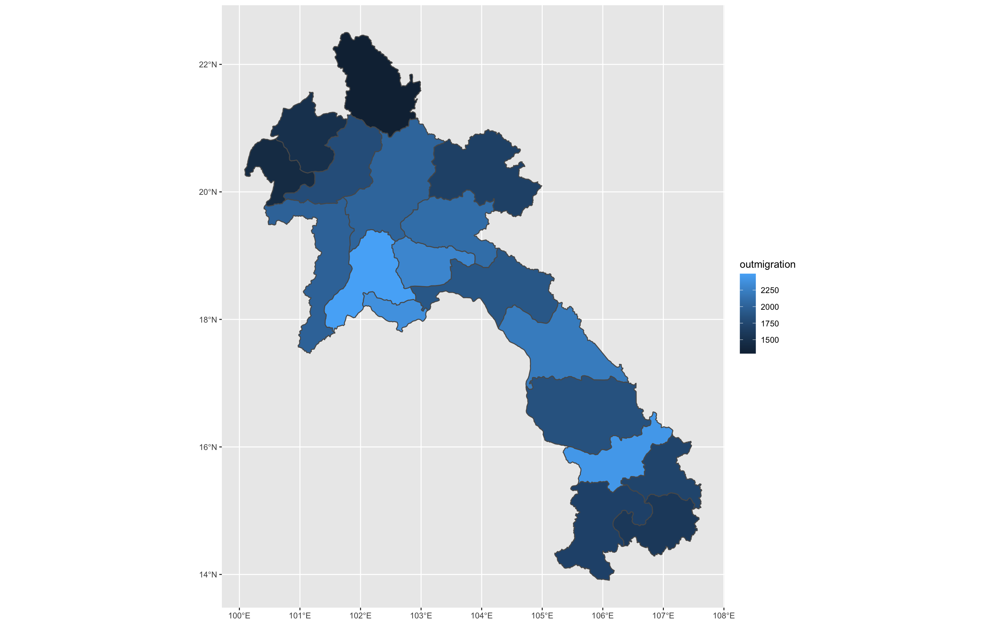
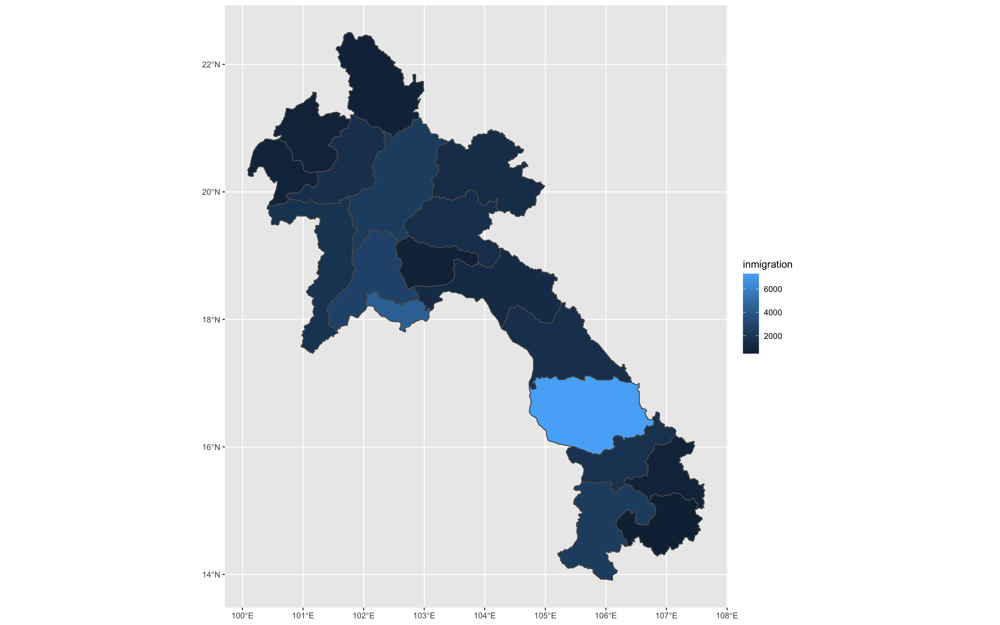
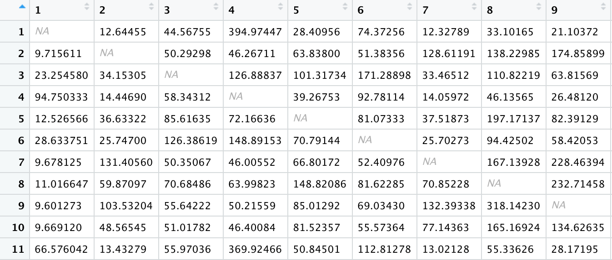
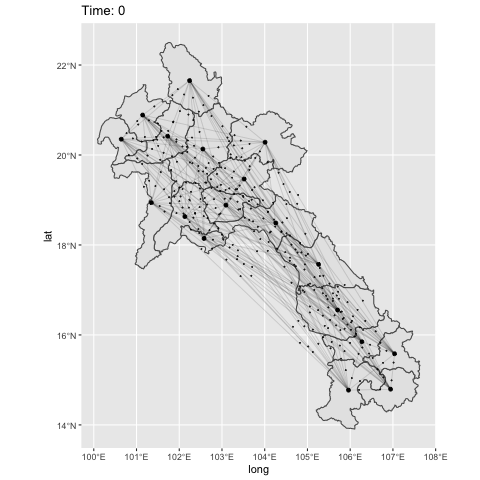

# Final Project

## Gravity Model
As an introduction to this project, we followed a guide by Dr Ds to create a gravity model for London. 
The paper written by Garcia et al. highlights the benefits of of using a gravity model as a tool for migration and undesrtanding how humans move.
For creating the model, we first created a distance matrix between all of the boroughs in London.
For creating flow estimates, we used the mode of transport data that was taken from the 2001 England and Wales Census survey that also included home address and work location.
The final, total flows column was created by combining the distances and the flows between each borrow.

Using the gravity model, we were able to look at flow estimates and compare them to the observed, original flows. 
To improve the model, a poisson regression model was considered since the data followed a poisson distribution rather than a normal distribution.

## Laos Migration Patterns
In the findings from the Garcia et al. paper, the models explained up to 87% of internal migration and can predict migration within the country with correlations up to 0.72.
Predicting this flow data is beneficial for areas where data is sparse but needed for planning, economic development, and controlling disease.

With this idea in mind, for this project I looked at migration within Laos.
The information on internal migration flows was downloaded from WorldPop from 2010.
Using this data, the plots below were created to show the migration based on the ADM1 subdivisions, where the size of the dots correlate to the migration.
The first plot represents the origin flows sum for each ADM1, and the second represents the destination flows sum for each ADM1.

**Origin Flows**

**Destination Flows**

With these sums, I made origin-destination matrix to look at the number of people migratiing between each subdivision. 
Below is a portion of the matrix, but there are 18 rows and 18 columns total to represent the 18 ADM1 subdivisions in Loas.
Each number represents one of the provinces.
The N/A values represent inter-migration, which was not calculated.
Using these numbers and including more data such as night time lights can be used as a predictor for estimating future/comparing past migration flows in a gravity model.

Afterwards, I created an animation to visualize the migration in Laos.
Looking at the OD matrix gives an idea of the number of migrations rather than just points.
Using the OD matrix, if possible, I would modify the number of points departing from each province to be proportional to the actual number of people.
Right now only a couple points are representing the sums which doesn't describe the migration that greatly.
In addition, a gravity model could be integrated along with the animation to show the estimated flows in comparison to the already observed migration flows.

The gravity model itself looks at the flows between an origin and destination.
The flows are proportional to the mass of the origin multiplied by the mass of the destination, and the flows are inversely proportional to the distance between the origin and destination.
In other words, as the masses of origin and destination increases, the flows also increase.
When distance increases, the flow decreases, and as distance decreases, the flow increases.
Because it takes these into consideration, incorporating a gravity model would help simulate migration patterns that are closer to reality.

## ADM2 Subdivision

o	How would you produce an OD matrix of these higher resolution entities? Which variables would you include? Are you lacking any data that would improve upon your model results?
o	How would you modify the number of points departing from each origin? How would you determine each points destination?
o	How would you modify the time variable? What scale is the temporal dimension at this level?
o	How would the gravity model update these attributes in order to produce a different simulation of migration?
o	How would you go about integrating migration and transport activities at the differing geospatial and temporal scales of these hierarchical levels?
