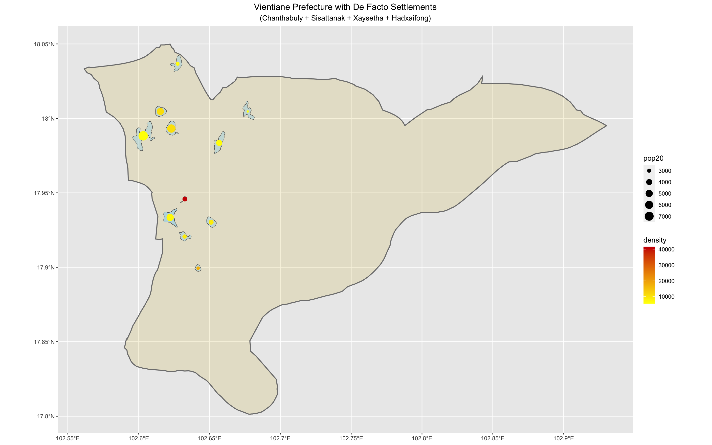

# Project One

## Part 1
### Deliverable
The image below has a heatmap of Laos showing the population and population density within each province labeled.
Red represents a high population and yellow the lower, which can also be seen visually with the numerical values of population density.
Next to the map is a barplot showing the percentage of total population in Laos each province makes up.
Again, red represents a higher percent of the total population.

These plots were made by using the ggplot() package in R.
Using the aggregated raster from the previous assignment, area was created manually, using the units() package, to then calculate population density for each province.
The values of population density were then added as additional labels to the heatmap for ADM1.
For the barplot, the provinces were rearranged from highest to lowest population and labeled by finding the percent of total population.

### Stretch Goal 1
This is a barplot with a visual representation of district (ADM2) populations within the provinces of Laos. 
The length of the smaller bars represents the proportion each district makes up of the provinces.
And again, the length of the larger bars represents the population in each province.

### De Facto Settlements in Vientiane [prefecture]
After looking at the populations of each ADM1, I decided to focus on the Vientiane Prefecture since I knew that is where the capital of Laos is located and also the aggregated population fits the guidelines.
Also, since the capital is located in this prefecture, there will be sufficient density areas to create the de facto settlements.
First I looked at Sisattanak District, but the area was too small and I wasn’t getting enough settlements.
Also, it looked like there was a settlement getting cut off towards the north area,
so, I combined the surrounding districts.
Below you can see each district cropped and masked with the population raster.
The left most polygon is Chanthabuly, Sisattanak below it, Xaysetha to the right of Sisattanak, and finally Hadxayfong below the three.
To join all the polygons together, I combined the rows using rbind(), then summarized all the shapes by their area to get a single polygon for further investigation.
Combined, the population of this subdivision is ~500,000.

For this plot, I used the spatial probability distribution to randomly place people within the subdivision.
This was done using the rpoint() in R.
You can see the darker areas reflect similar density to the raster image.

The bw.ppl() command defines the value of the bandwidth that was then used in the spatial probability function for describing the population density of the subdivision.
The bandwidth was then used with the density.ppl() function to produce the plot below.
On the map, there are contour lines trying to capture the urban areas.
I set the levels to 5e+7.

Using the contour lines the de facto settlements were created.
I had to try many different levels and filtering out extraneous settlements before finding settlements that seemed to represent the subdivision the best.
A lot of the time there were settlements that were repeated, numbers that were too small for the area, or hidden.
The dark red represents the highest density and larger spots mean a higher population.
For the most part, I think this plot reflects the density plot and captured the correct general areas where density was higher.
The single dark red spot is about where the center of the capital is, so I do think that the density is represented correctly, but I'm not sure whether or not the population number is well represented.
This may have occurred because of the filtering process for the polygons.
The final count was 12 de facto settlements.

### Looking at Zipf's Law

The graph shows my attempt to look at Zipf's Law in relation to the settlements population and rank.
Majority of the settlements follow the power law and show an inverse relationship, but there are some deviations from Zipf's Law within the middle.

## Part 2
### Roads and Health Centers
**Roadways**
To start looking at the accessibility of roads to health care centers, I first read in a roads shapefile for Laos.
I filtered out the primary, secondary and tertiary roads for the subdivision.
The primary roads are represented in the map a little thicker than the secondary and tertiary roads.
You can see that the primary roads run through almost all the de facto settlements.
Otherwise, the secondary and tertiary roads are able to reach the settlements outside of the primary road network making the level of service possible between settlements.

**Hospitals**
For hospitals I followed similar steps.
I filtered out just hospitals since there were already a lot within this subdivision and would have been hard to see if I included clinics or pharmacies, etc. as well.

**Urban Areas with Roads and Hospitals**
Looking at the map with the settlements included, there are many hospitals near by the settlements and are all accessible by the road network.
The hospitals don't seem to have a strong pattern on where they are placed in relation to the settlements, i.e. there's not one hospital right next to each settlement.
They are mostly clustered towards the west side of the subdivision, which is interesting since there is a river located off of the subdivision.

*note: I attempted looking at the topography, however the rayshader package will not load in my Rstudio for some reason*