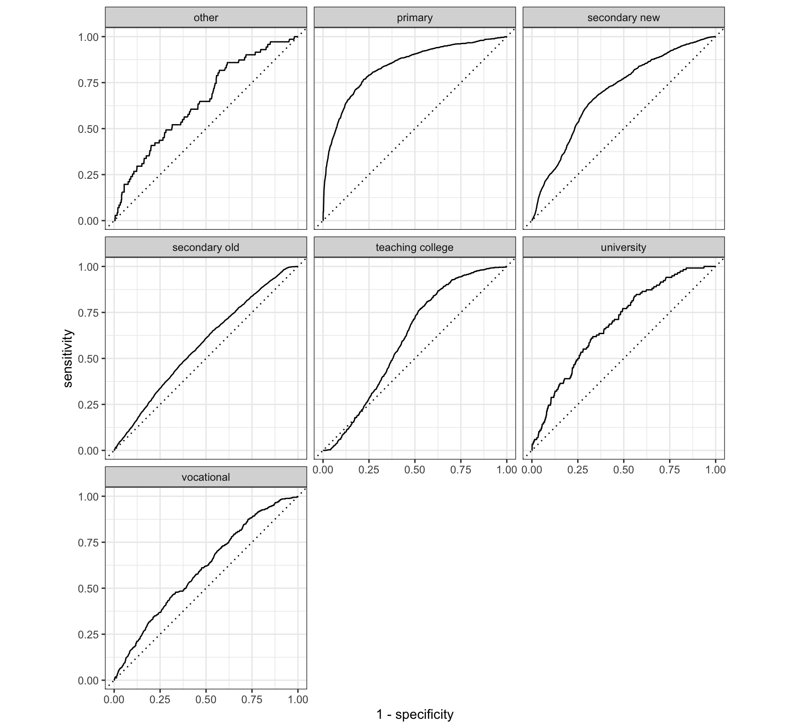

# Project Two

## DHS data

In project one, I looked at creating de facto settlements for Laos; however, there were no household surveys available on the DHS program's website. 
So for this project, I requested and used the DHS household survey for Thailand since it borders the south of Laos.
The 1987 survey includes 9045 households with the 43,442 person observations.

These were the following survey variables that were used:

* **qnum**: survey household id
* **nopers**: household number of persons (size)
* **hhwt**: household sample design weight
* **hhsex**: sex
* **hhage**: age
* **hhgra**: highest education level

Provide a written description of your selected household survey including the number of household and person 
observations as well as the variables in your source data.

## ADM0 level

To create a variable for number of households in Thailand, I used the total population raster divided by the average household size from the DHS survey.
This ended up being about 15.6 million observations, which makes sense since the total population for Thailand is around 70 million.
With this variable, I used rpoint() to create random points based off of the total population raster and used the coordinates of those points for the observations in a sample taken from the DHS household survey.
The sample was generated by using slice_sample() that randomly takes ~15.6 million (number of households) observations from the DHS survey.
The percent error of this sample was 0.0001210817 or 0.012%.
Since there was such a large amount of households, I couldn't get R to expand the demographic attributes of individual persons or spatially locate them/plot a graph.

## ADM1 level
### Nong Khai

At the amd1 level, I focused on Nong Khai Province since it bordered the area I looked at for project one.
Similar to the adm0, to generate spatially located households, I first started by looking at the number of households in Nong Khai.
The resulting number was 86,855 households.
Again, I took random points based on the population raster for Nong Khai, and a random sample of 86,855 households from the DHS survey where the observations were located only in Nong Khai.
The calculated percent error was 0.0002475691 or 0.025%, which was slightly higher than at the adm0 level.
Expanding age, gender, education, was much more doable at the adm1 level.
However, this survey is quite old so there were missing values sometimes that caused each attribute to have different numbers of individuals.
After joining the demographic attributes, there were 416,172 individual observations and they are plotted below.

Looking just at the calculated percent error, the adm1 generated population is less accurate than the adm0 level.
The plot below compares the density and size of households in the DHS data where yellow represents all the households in Thailand and the green line represents the households in Nong Khai.

This plot looks at the density and size of households using a sample for households in all of Thailand and a sample for households in Nong Khai. In comparison, there is less homogeneity in the sampled data which suggests that using the whole data can improve the accuracy rather than just the sample subset.

## Predicting

Using the raw data I generated heat maps for household size, gender, education, and age. 
This is showing the possible outcomes and combinations when each variable is used as a predictor.
The more purple means that a variable has less predictive power, so I tried scaling, normalizing, and transforming the data into percentiles to improve the predictive power.
Transforming the data into percentiles had the best outcome.

Following the heatmaps, I was able to split, train, and test multiple predicting models: multinomial, ranger, and random forest regression, and neural network.
The variables I used to predict education were size, gender, and age.
I used the tidymodels, randomForest, and keras libraries to help build each model.
After creating and testing the regression models, I genderated gain and ROC curves.

### Multinomial Regression

**Gain Curve**

**ROC Curve**

### Ranger Regression

**Gain Curve**

**ROC Curve**

### Random Forest Regression**

**Gain Curve**

**ROC Curve**

### Neural Network

I was also able to produce a neural network model for predicting education with normalized predictors.
Using the script given in class, the plot below shows the predictions made by the model.

The three regression models all had similar accuracy at 61.8% while the neural network was also close just at 61.6%. 
I would need to look more closely at other factors such as the p-values/deviances/AIC/BIC scores for each model in order to pick the best model fit for the household demographic data.